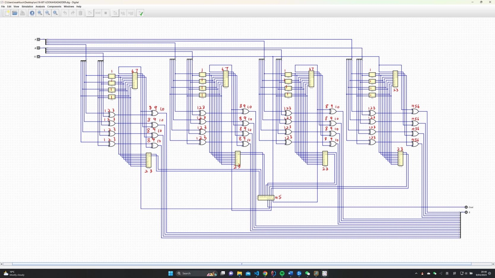
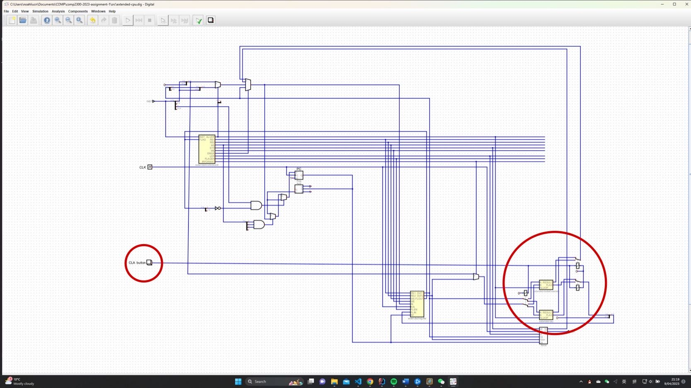

# Report of the extensions

Instruction Lookup table
## ALU Immediates
I created 4 new cpu instructions to implement ALU operations in I-format that
can operate on 8-bit immediate numbers. I changed the 0 in the 14th bit to 1
on top of the traditional 4 operator machine code to turn it into an I-format 
instruction.

In the Control Unit of my CPU, I added an output `IRFORMAT` to specify whether
the instruction is R-format (output 0) or I-format (output 1) to make it easier
to determine whether to enter output-2 in the register (R-format) or an 8-bit
immediate (I-format) of bits 0-7 of the instruction into the `B` of the ALU operator.

I did not change the set name as for `quac.json`, the R-format instructions and I-format
instructions can be parsed differently. When I give an instruction `add r1, 15`, the first line
of the `demo.quac` without the prefix "r", it will be parsed as an immediate number, so that to 
implement the machine code `1100 0001 0000 1111`. After executing the instruction, the value stored
in `r1` now is 15.

## PC Relative Jump
It is also possible to perform immediate arithmetic on the program counter on
completing the ALU immediates.

When to operate programmer counter in ALU, `RS1=111`, inside the register, I added
the input `R7 (PC)` to correspond to the output when `RS1` or `RS2` is `0b111`.

For the second line of the `demo.quac`, the instruction is `add pc, 2`, after executing it, the value of
the `pc` now is 1+2=3.

## Expanded Register File
I expanded the register file to 16 registers (with `fl` and `pc`) and correspondingly change the 
`RS1` `RS2` `WS` to 4-bit. As for all instructions `rd` cannot be extended to 4-bit, then add a `0` in the most
significant bit in Control Unit for `rd` to meet the 4-bit requirement for `RS1` `RS2` `WS`.

I created a new instruction `COPY` to store values for extended registers. The instruction `COPY rd, imm4` will be implemented 
as `reg[imm4] := rd` to solve the problem that `rd` can only be 3 bits that can not store data to the extended registers.
I added a status for DMUX `11` to implement this instruction to allow a register copy the value of another register.

e.g.

4th line `copy r1, 14` of `demo.quac` will copy the value "15" stored in `r1` to `r14`.

5th line `adde r2, 14, 14` will store the sum of `r14 + r14` to `r2`.

## Carry lookahead Adder
For ripple carry adder, each full-adder can be computed when the previous bit's full adder completes the calculation
and produces the carry bit Cin. The carry lookahead adder allows the carry bit Ci for each bit to be calculated in advance, and then the 
summation calculation is performed separately for each bit.

We can find the pattern `Ci = Ai*Bi+Ai*C(i-1)+Bi*C(i-1) = Ai*Bi+(Ai+Bi)*C(i-1)` where `i` represents the bit.

So, we let `Gi = AiBi` for generating carry signal, `Pi = Ai+Bi` for passing carry signal.

We can see when both Ai Bi are 1, the resulting progression Ci = 1; when one of Ai and Bi is 1, then pass progression C(i-1) to Ci = C(i-1).

First, I built a 4-bit carry lookahead adder. I used the pattern Ci to calculate separately C0 C1 C2 C3.

`C0 = Cin = G0*P0*Cin`
`C1 = G1+P1*C0 = G1+P1*G0+P1*P0*Cin`
`C2 = G2+P2*C1 = G2+P2*G1+P2*G1+P2*P1*G0+P2*P1*P0*Cin`
`C3 = G3+P3*C2 = G3+P3*G2+P3*P2*G1+P3*P2*P1*G0+P3*P2*P1*P0*Cin`
`Cout = C3`

By building a `PG unit`, `Pi` and `Gi` will be calculated firstly. And I built a `CLU (Carry lookahead unit)` to calculate
carry bit for each bit. To sum them up, 

According to recursion, we can also apply this approach to 16-bit operations to build a 16-bit carry lookahead adder directly.
However, the operations to be involved in 16 bits are too complex, so I split it into four 4-bit lookahead adders.

For `C3 = G3+P3*C2 = G3+P3*G2+P3*P2*G1+P3*P2*P1*G0+P3*P2*P1*P0*Cin`, we can let `Gm0 = 
G3+P3*G2+P3*P2*G1+P3*P2*P2*G0` and `Pm0 = P3*P2*P1*P0` so we can express `C3 = Gm0+Pm0*Cin`.

Thus, we get:

`C3 = Gm0+Pm0*Cin`
`C7 = Gm1+Pm1*Gm0+Pm1*Pm0*Cin`
`C11 = Gm2+Pm2*Gm1+Pm2*Pm1*Gm0+Pm2*Pm1*Pm0*Cin`
`C15 = Gm3+Pm3*Gm2+Pm3*Pm2*Gm1+Pm3*Pm2*Pm1*Gm0+Pm3*Pm2*Pm1*Pm0*Cin`

So I built a PGM generator in the 4-bit lookahead adder to generate the Gm and Pm for each 4-bit group. If we define the
time the current takes to pass one logic gate including `AND` `NOT` and `OR` gates as one unit time "T", and the `XOR` gate will
take 3T as it will go through a `NOT` gate, then an `AND` gate and then an `OR`gate.

For 16-bit carry lookahead adder, the current for each unit time is listed in the image below.

In T1 to T3, the adder will calculate the sum of A and B by each bit. At the same time, the result of Pi, Gi, Gmi, Pmi, and the carry bit in the 4-bit
cla is generated. In T4 to T6, the final sum for bit 0-3 is done and the C3, C7, C11 and C15 will finish the calculation in T5 and then will flow into
the 4bit cla for bit 4-7 8-11 12-15. Then the final result will be done after T10. Thus, we only have to wait for 10 unit time's delay for current to pass
through the logic gates.

For one bit ripple carry full-adder, the delay is 6T as there are two `XOR` gates inside, and for each bit the full adder should wait for the result of previous 
carry bit, so the delay for 16-bit ripple full adder is much larger than the CLA.

However, the CLA takes up far more gates, it requires much more power consumption. For a 16-bit CLA it requires 154 gates and for 4 bit ripple carry adder it only needs 64 gates.

In my CPU, I add a button and a double throw relay to allow switching between a ripple carry ALU and the carry lookahead ALU.

(987 words)